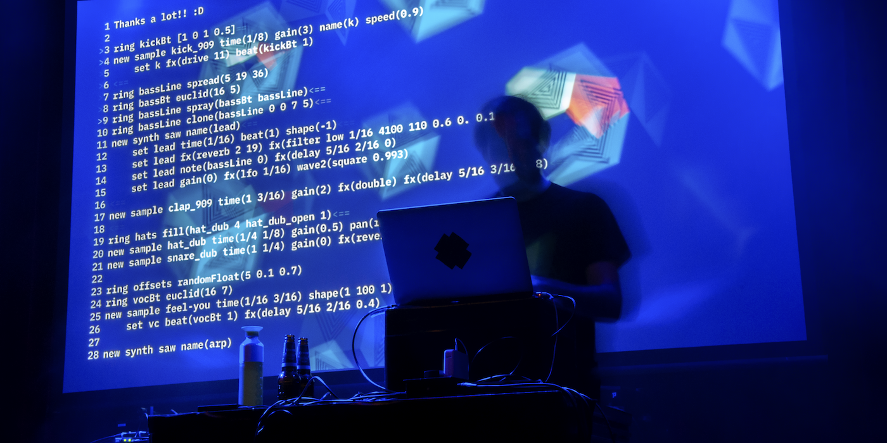

---
headerincludes:
	- \usepackage{fontspec}
	- \setmainfont{Arial}
	- \usepackage[english]{babel}
title: Hacking Electronic Music
author: Timo Hoogland
mail: info@timohoogland.com
fontsize: 11pt
geometry: margin=2.2cm
pagestyle: plain
papersize: a4
# fontfamily: Arial
# fontfamily: inconsolata
mainfont: Arial
monofont: Inconsolata
documentclass: article
linestretch: 1.1
...

{ width=100% }

# Algemene Info

**lengte**: +/- 3 uur (langer of korter mogelijk)

**deelnemers**: Max. 20 people (voorkeur < 15)

**leeftijd**: 16+

**skills**: geen programmeer of muzikale kennis nodig

**computer**: Eigen laptop (met Google Chrome) en koptelefoon

**taal**: Nederlands (spreken, ook mogelijk in het Engels), Engels (schrijven)

**system vereisten**: 

- Mac 10.11+ / Windows 10 / Linux: 
	- Intel Core i5 processor (of beter)
	- 4 GB RAM (8 GB of meer bij voorkeur)
	- Brave or Google Chrome (of andere Chromium Web Browser)

# Workshop beschrijving

In de toekomst wordt muziek misschien wel door Artificial Intelligence gemaakt. Maar tot dat zover is kan jij al wel met code en algoritmes elektronische muziek programmeren!

In deze cursus leer je om elektronische muziek te maken met computercode en algoritmes! Hiervoor gebruik je de programmeeromgeving "Mercury". Jij programmeert de instructies en de computer vertaald dat naar beats, synths, catchy melodiën en meer. Je kan de code aanpassen terwijl je muziek afspeelt en gelijk het resultaat horen. Welkom in de wereld van Live Coding! Aan het eind van de workshop ben je in aanraking gekomen met technologie en technieken die gebruikt worden in moderne muziek zoals sampling, synthesis en sound design en heb je ervaren hoe het is om algoritmes te gebruiken voor componeren van muziek.

## Over Timo

Ik ben live coder, muziektechnoloog en digitaal kunstenaar. Ik geef les in programmeren en ontwerpen van geluid, muziek en audiovisuele kunst aan de Hogeschool voor de Kunsten Utrecht (HKU). Ik treed veel op als live coder, ook in combinatie met drums. Hierbij programmeer ik elektronische muziek, veelal een mix tussen Acid, Industrial Techno, Psytrance en IDM. Daarnaast programmeer ik ook (audio)visueel werk voor installaties. Je kunt meer van mijn werk vinden op www.timohoogland.com of @tmhglnd op instagram.

<!-- # Topics -->
<!-- - What is livecoding? -->
<!-- - How is it used by artists? -->
<!-- - What forms of artistic expressions with livecoding can be found? -->
<!-- - Repertoire from artists? -->
<!-- - What languages and environments can be used for livecoding? -->
<!-- - What is Mercury? -->
<!-- - What is Mercury for and how is it different or similar to other livecoding languages? What is the concept and vision behind the language? -->

# Technische Benodigdheden

**Geluid**:

- Stereo speakers en mixer (PA) met stereo-DI of mini-jack aansluiting
	- In overleg zijn andere speakers ook mogelijk

**Beeld**:

- Projector of groot tv-scherm met HDMI connectie
- Flipover of whiteboard en zwarte (of gekleurde) markers

**Voor deelnemers**:

- Tafels
- Stoelen
- Voldoende stekkerblokken op tafel

**Consumpties**:

- Koffie / Thee / Water / Limonade
- Snacks & Fruit en/of Lunch/Avondeten (afhankelijk van lengte en tijdstip van de workshop)

# Met dank aan

- Mercury is mede mogelijk gemaakt door subsidie van het Stimuleringsfonds Creatieve Industrie
- Mercury is mede mogelijk gemaakt door steun van Creative Coding Utrecht

## hashtags

#electronicmusic #algorithmicmusic #creativecoding #livecoding #algorithmiccomposition #sounddesign #digitalart #digitalculture #diyprogramming #algorave #performanceart
