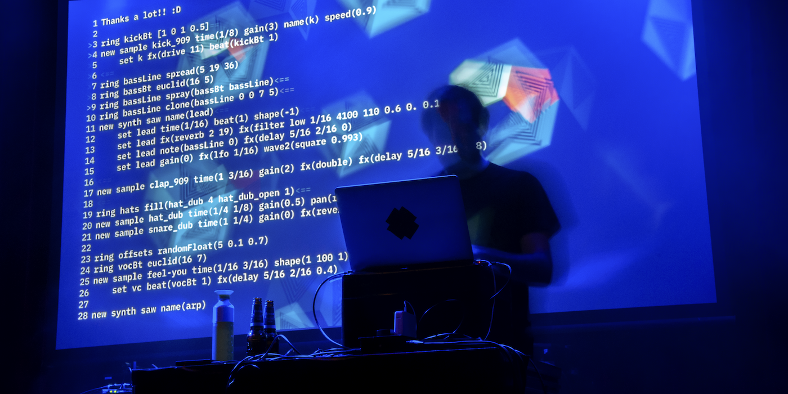

---
headerincludes:
	- \usepackage{fontspec}
	- \setmainfont{Arial}
	- \usepackage[english]{babel}
title: Hacking Electronic Music
author: Timo Hoogland
mail: info@timohoogland.com
fontsize: 11pt
geometry: margin=2.2cm
pagestyle: plain
papersize: a4
# fontfamily: Arial
# fontfamily: inconsolata
mainfont: Arial
monofont: Inconsolata
documentclass: article
linestretch: 1.1
...

{ width=100% }

# General info

**length**: +/- 3 hours (longer or shorter possible)

**participants**: Max. 20 people (preferably +/- 15)

**ages**: 16+

**skills**: no programming or musical experience required!

**computer**: Bring your own laptop and headphones

**language**: English/Dutch (depending on the participants)

**system requirements**: 

- Mac 10.11+ / Windows 10 / Linux: 
	- Intel Core i5 processor (or faster recommended)
	- 4 GB RAM (8 GB or more recommended)
	- Chromium based browser (Brave, Arc, Google)

**website**:

- [mercury.timohoogland.com](https://mercury-playground.pages.dev/)

# Workshop description

Join this crash-course into the exciting world of live coding music. No previous knowledge of programming required, only a desire to express yourself creatively! During this workshop you will learn to create electronic music with computercode and algorithms! For this we use the programming language Mercury. You will program the instructions and the computer will translate that to beats. You can adjust the code in real time while the music is playing and hear it change. Welcome to the world of Live Coding! At the end of the workshop you have been introduced to technologies used in electronic music production and you will have experienced what it means to use algorithms to compose music and sound.

# In-depth description of Mercury

Mercury is a minimal and human-readable language that focusses on quick expression in composing, performing and communicating live coded music. Mercury is a great environment to get introduced to the amazing worlds of live coding, creative coding, algorithmic composition, electronic music and of course the Algorave scene! In Mercury, all elements of the language are designed around making code more accessible and less obfuscating for the performer and the audience. This motivation stretches down to the coding style itself which uses clear descriptive names for functions and a clear syntax. Furthermore the environment runs in the browser so it is available to you at all times. Mercury provides the artist-programmer with an extensive library of algorithms to generate sequences, sounds and music.

<!-- # Topics -->
<!-- - What is livecoding? -->
<!-- - How is it used by artists? -->
<!-- - What forms of artistic expressions with livecoding can be found? -->
<!-- - Repertoire from artists? -->
<!-- - What languages and environments can be used for livecoding? -->
<!-- - What is Mercury? -->
<!-- - What is Mercury for and how is it different or similar to other livecoding languages? What is the concept and vision behind the language? -->

# Goals

## Starter Goals
- Learn to play a sample
- Change the timing of the played sound
- Make lists as rhythms and use probabilities
- Generate lists with functions

## Intermediate Goals
- Learn to play a synth
- Make lists as melodies and rhythms for the synth
- Generate lists of melodies and rhythms with functions

## Advanced Goals
- Combine functions to generate more complex melodic and rhythmical structures
- Add effects for sound designing
- Sequence parameters of effects and other functions
- Include visuals coded with Hydra
- Control synths with external devices via OSC
- Sequence other applications via MIDI output

# Schedule (by approximation)

15 minutes :

<!-- - Downloading the software -->
- Introduction to livecoding and showcase some works
<!-- - Short demonstration -->
<!-- - Installing / Trouble-shooting -->

30 minutes :

- Syntax Explanation
- Work on starter goals

30 minutes :

- Play and explore possibilities with rhythms

15 minutes :

- Break

30 minutes :

- Work on Intermediate goals

45 minutes :

- Play and explore!
- Individual help/questions
- Optional move to Advanced goals

15 minutes :

- Wrap up
- Participants show their creations

# Technical Requirements

*for more details see the Workshop Technical Rider*

**Sound**:

- Speakers and Mixer (PA) with mini-jack

**Visual**:

- Projector or screen with HDMI connection
- Flipover board or whiteboard and black (or colored) markers

**Participants**:

- Tables
- Chairs
- Power sockets on table

**Consumptions**:

- Coffee / Tea / Water / (Soda)
- Snack or lunch (depending on length and time of workshop)

# Thanks to

- Mercury has been granted funding from [**Creative Industries Fund NL**](https://www.stimuleringsfonds.nl/en)
- Mercury is sponsored by [**Creative Coding Utrecht**](https://creativecodingutrecht.nl/)